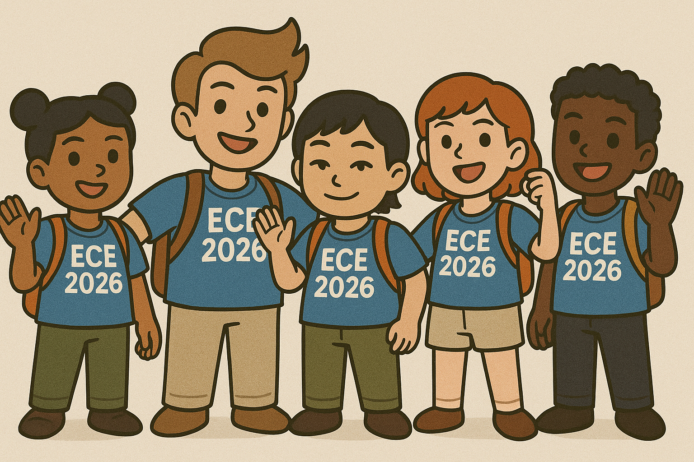

# 02-Team Repo
Template for team repo

This is my team

## Team links
- [Team Google Drive]()

## Course links
- [ECE Senior Design Piazza Site](https://piazza.com/bu/fall2025/ec463/home)
- [Blackboard](http://learn.bu.edu/)

## Optional features links
- Team Jira
- Team Confluence
- Something else

Our team's project involves taking an scanning electron microscope's (SEM) scanning and detector voltage waveforms and feeding them to a FPGA-based SoC hardware platform, 
which converts those signals into a digital format to be sent via USB over to a host PC. 
